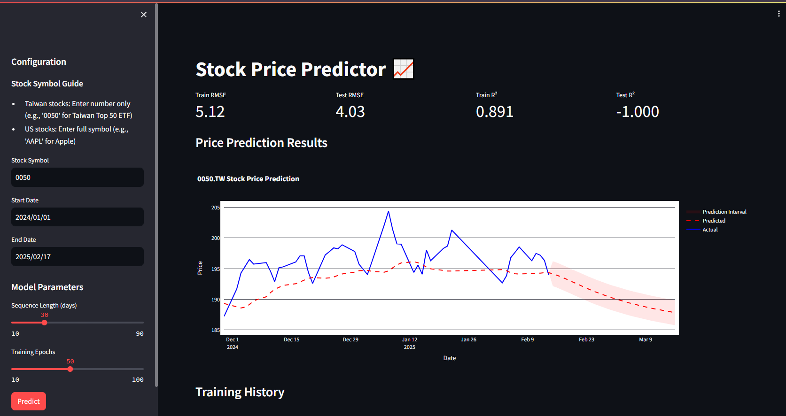

# Stock Price Predictor

This project uses LSTM (Long Short-Term Memory) neural networks to predict stock prices based on historical data and forecast future trends.

## Features
- Fetches historical stock data using yfinance
- Preprocesses data using MinMaxScaler
- Implements LSTM neural network for time series prediction
- Provides performance metrics (RMSE and R² score)
- Visualizes predictions vs actual prices
- Future price predictions with confidence intervals
- Docker support for easy deployment
- Live code editing through volume mounts

## Web Demo

Example prediction showing historical data, current predictions, and future forecast with confidence intervals:



## Local Installation

1. Clone this repository
2. Install dependencies:
```bash
pip install -r requirements.txt
```

## Docker Usage

### Using Docker Compose (Recommended)

1. Build and start the container:
```bash
docker-compose up -d --build
```

2. View logs:
```bash
docker-compose logs -f
```

3. Stop the container:
```bash
docker-compose down
```

### Using Docker Directly

1. Build the image:
```bash
docker build -t stock-predictor .
```

2. Run the container:
```bash
docker run -d \
  -v $(pwd)/data:/app/data \
  -v $(pwd)/models:/app/models \
  -v $(pwd)/app.py:/app/app.py \
  -p 8501:8501 \
  --name stock-predictor \
  stock-predictor
```

## Model Configuration

The stock prediction model:
- Uses 60-day sequences for prediction
- LSTM architecture with two layers (50 units each)
- Dropout layers (0.2) for regularization
- Training/Testing split: 80%/20%
- Customizable training epochs (default: 50)
- Future prediction window: 30 days
- Confidence intervals based on prediction variance

## Data Storage
- Trained models are saved in the `models/` directory
- Historical data is cached in the `data/` directory
- Both directories are mounted as Docker volumes for persistence
- app.py is mounted for live development

## Default Settings
- Default stock: TSMC (2330.TW)
- Default start date: 2025-01-01
- End date: Current date
- Timezone: Asia/Taipei

## Interactive Features
- Stock symbol input (Taiwan/US markets)
- Adjustable date range
- Configurable sequence length and epochs
- Real-time visualization updates
- Future trend predictions with uncertainty ranges

## Output
The application displays:
- Training and Testing RMSE (Root Mean Square Error)
- R² scores for both training and testing sets
- Interactive plot with:
  - Historical prices (blue line)
  - Model predictions (red dashed line)
  - Future predictions (with confidence intervals)
- Training loss history visualization
